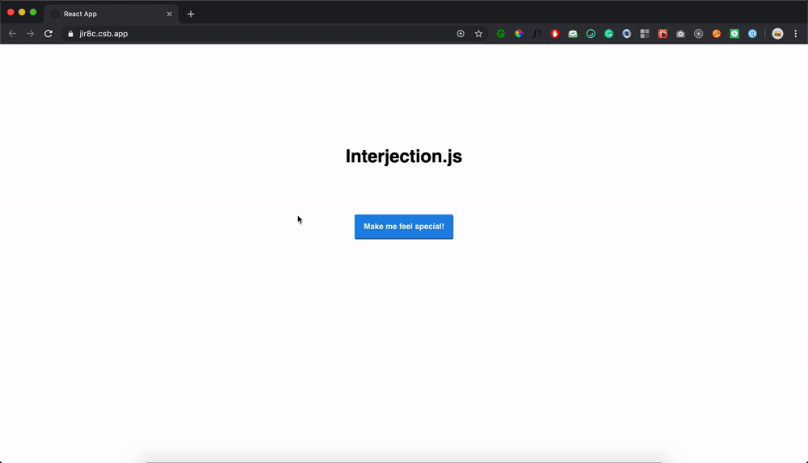

 <div align="center">
  <h2>Interjection.js</h2>
  <blockquote>Generate random cool interjections</blockquote>
</div>

## 🎬 Demo

<div align="center">
 
</div>

Mess around the [CodeSandbox repo](https://codesandbox.io/embed/interjection-js-jir8c)!

## 📦 Getting Started

```
npm install --save-dev interjection-js
```

or

```
yarn add interjection-js
```

## 🚀 Usage

```
import generateInterjection from 'interjection-js';

const randomInterjection = generateInterjection();
...
```
